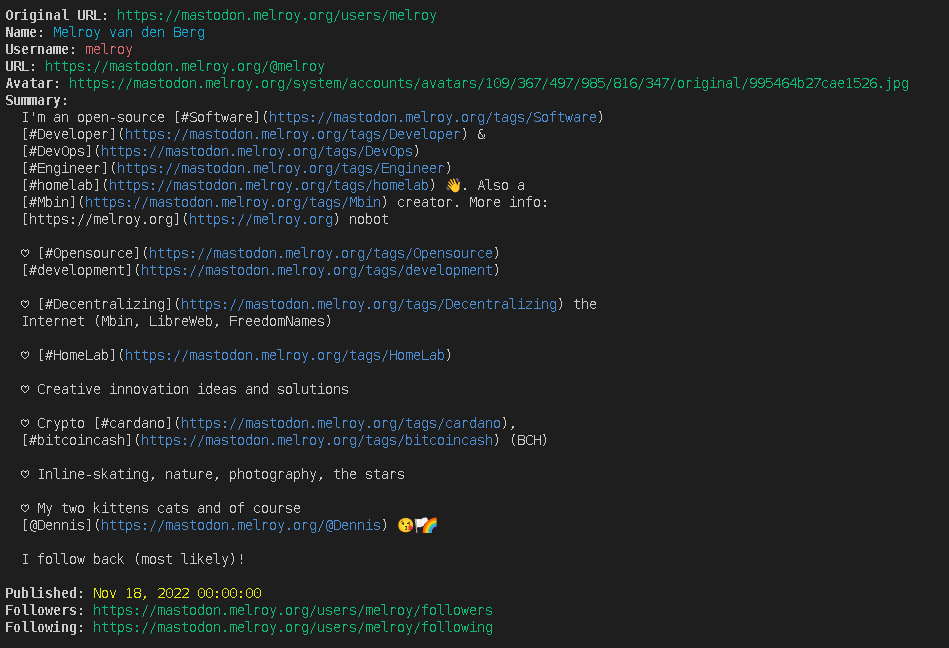

# FediResolve

FediResolve is a command-line tool for resolving and displaying Fediverse content. 

It can parse and display ActivityPub content from various Fediverse platforms including Mastodon, Mbin, Lemmy, PeerTube, and others. For easy reading or debugging purposes.

~ Vibe coded within 2 hours.

## Features

- Resolve Fediverse URLs to their ActivityPub representation
- Resolve Fediverse handles (e.g., @username@domain.tld)
- Display both the full JSON data and a human-readable summary
- Support for various ActivityPub types (Person, Page, Note, Article, etc.)
- Automatic resolution of shared/forwarded content to the original source



## Download

[FediResolve for Linux](https://gitlab.melroy.org/melroy/fediresolve/-/releases)

## Installation

Either download the prebuild binary from [releases](https://gitlab.melroy.org/melroy/fediresolve/-/releases) or build from source, see below.

### Prerequisites

- Go 1.21 or later

### Building from source

```bash
git clone https://gitlab.melroy.org/melroy/fediresolve.git
cd fediresolve
go build
```

## Usage

### Basic usage

```bash
# Provide a URL or handle as an argument
./fediresolve https://mastodon.social/@user/12345
./fediresolve @username@domain.tld

# Or run without arguments and enter the URL/handle when prompted
./fediresolve
```

## Examples

### Resolving a Mbin thread

```bash
./fediresolve https://kbin.melroy.org/m/til/t/875629/Context7-Up-to-date-documentation-for-LLMs-and-AI-code-editors
```

### Resolving a Mastodon post

```bash
./fediresolve https://mastodon.melroy.org/@melroy/114297155915355913
```

### Resolving a user profile

```bash
./fediresolve @melroy@melroy.org
```

## How it works

FediResolve uses the following process to resolve Fediverse content:

1. For handles (`@username@domain.tld`), it uses the WebFinger protocol to discover the ActivityPub actor URL
2. For URLs, it attempts to fetch the ActivityPub representation directly. Or if the content is needs to be resolved from another Fediverse instance.
3. Content is parsed and displays both the raw JSON object and a nice looking summary.

## License

MIT
